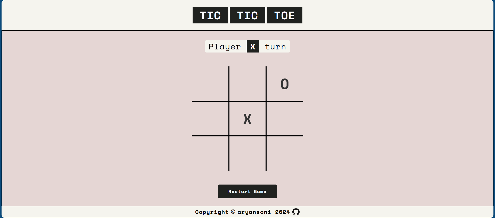

# ⭕ Tic-Tac-Toe ❌



You can try the Tic-Tac-Toe game live [here](https://aryansoni-git.github.io/odin-tic-tac-toe/)! 🌐

## Description

This project, developed as part of "The Odin Project" JavaScript course, is a simple web-based implementation of the classic tic-tac-toe game. It allows two players to take turns placing their markers ('X' or 'O') on a 3x3 grid until one player wins or the game ends in a draw.

## Table of Contents

| Section              |
| --------------------|
| [Demo](#demo)        |
| [Features](#features)|
| [How to Use](#how-to-use) |
| [Installation](#installation) |
| [Contributing](#contributing) |
| [Contact](#contact)  |
| [Acknowledgements](#acknowledgements) |
| [Future Enhancements](#future-enhancements) |


## Features

- Responsive and intuitive user interface.
- Dynamic updating of game status and player turns.
- Comprehensive error handling to prevent invalid moves.
- Option to restart the game at any time.
- Clear indication of game outcomes, including wins and draws.


## How to Use

1. Players take turns clicking on the empty squares of the grid to place their markers.
2. The first player to align three of their markers horizontally, vertically, or diagonally wins the game.
3. If all squares are filled without any player achieving a winning combination, the game ends in a draw.
4. Click the "Restart Game" button to start a new game at any time.


## Installation

There's no need for installation. Simply download or clone the repository to your local machine and open the `index.html` file in a web browser.

```bash
git clone https://github.com/aryansoni-git/odin-tic-tac-toe
```
## Navigate to the project directory:

```bash
cd odin-tic-tac-toe
```

## Contributing

Contributions are welcome! If you'd like to contribute to this project, please follow these steps:

1. Fork the repository.
2. Create a new branch (`git checkout -b feature/new-feature`).
3. Make your changes.
4. Commit your changes (`git commit -am 'Add new feature'`).
5. Push to the branch (`git push origin feature/new-feature`).
6. Create a new Pull Request. 

## Contact

If you have any questions or suggestions regarding this repository, Feel free to connect with me on any of the platforms listed below. I'm excited to hear from you and chat about all things tech!

| Platform | Link |
| --- | --- |
| Email | [](mailto:aryansoni.work@gmail.com) |
| GitHub | [](https://github.com/aryansoni-git) |
| Twitter | [](https://twitter.com/aryansoni_x) |
| LinkedIn | [](https://www.linkedin.com/in/aryansoni-work) |
| Instagram | [aryansoni.ig](https://www.instagram.com/aryansoni.ig/) |

## Acknowledgements

- Special thanks to [The Odin Project](https://www.theodinproject.com/) for providing the educational resources and project idea that inspired this library project.
- Thanks to [Google Fonts](https://fonts.google.com/specimen/Space+Mono?query=space+mono) for providing the Poppins font, which was used in this project.

## Future Enhancements

One potential future enhancement for this project is to implement an AI mode, allowing players to play against the computer. This would involve integrating AI logic using algorithms such as minimax or alpha-beta pruning to provide a challenging single-player experience.
